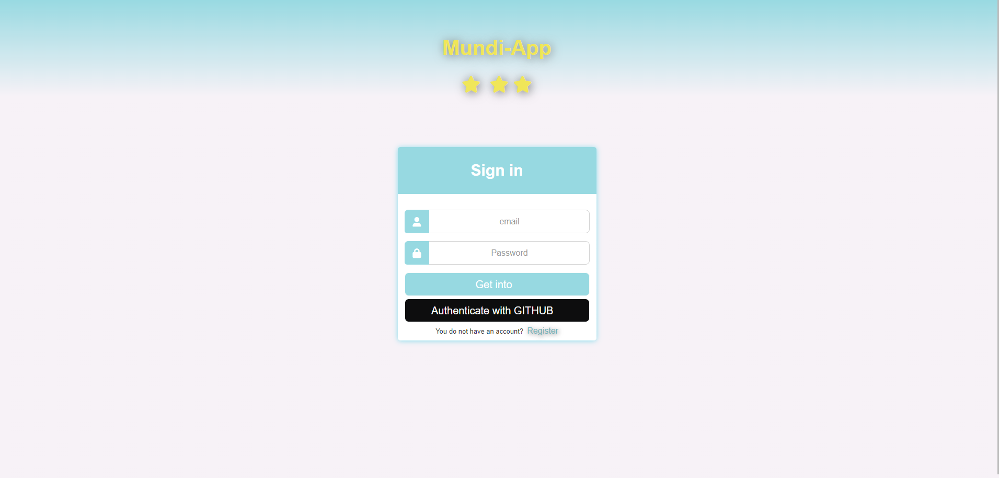
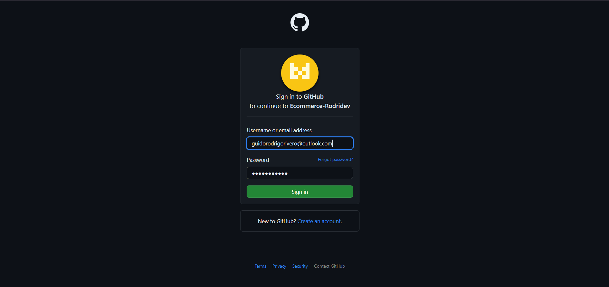
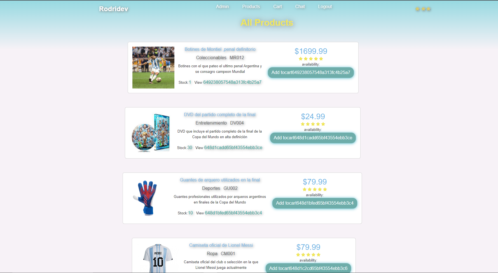
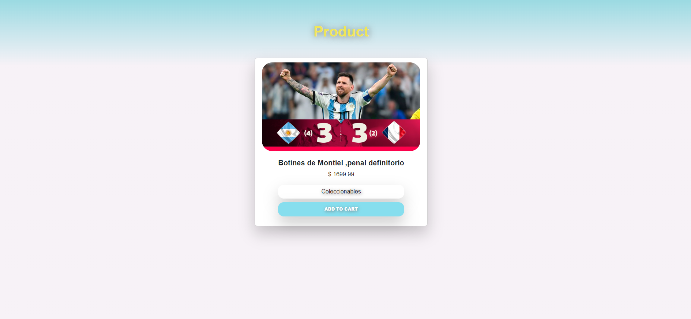
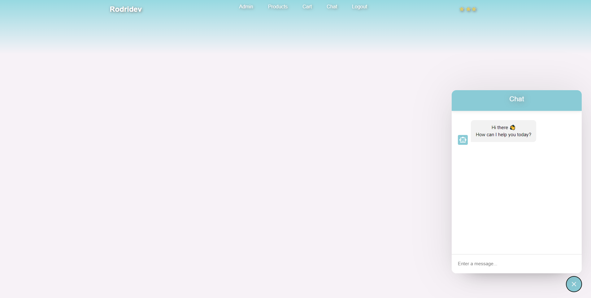

 # About this project

## Run

```
>npm install // instala dependencias
```

```
>npm run start // node
>npm run dev // nodemon
```

## Documentación Postman

https://documenter.getpostman.com/view/27128483/2s93eYUXAm
formulario para agregar productos


 






### Icons

https://fontawesome.com/search?q=menu&o=r

### Styles

https://getbootstrap.com/

css magic

### Dependencias:

- Express

```
    npm install express
```

```
npm i morgan -D
```

- websocket

```
npm i socket.io
```

- Conexión con MongoDB

```
npm i mongoose
npm i connect-mongo
```

- Variables de entorno

```
npm install dotenv --save
```


```

```

- Pagination

```
 npm i mongoose-paginate-v2
```

- Cookies

```
npm i cookie-parser
```

- Session

```
npm i express-session
```

- Bcrypt

```
npm i bcrypt
```

- Passport Y estrategia passport-local

```
npm i passport passport-local
```


```

- Usar passport con github

```
npm i passport-github2
```

Licencia 📄
Este proyecto está bajo la Licencia (RodriDev) - mira el archivo LICENSE.md para detalles

Expresiones de Gratitud 🎁

